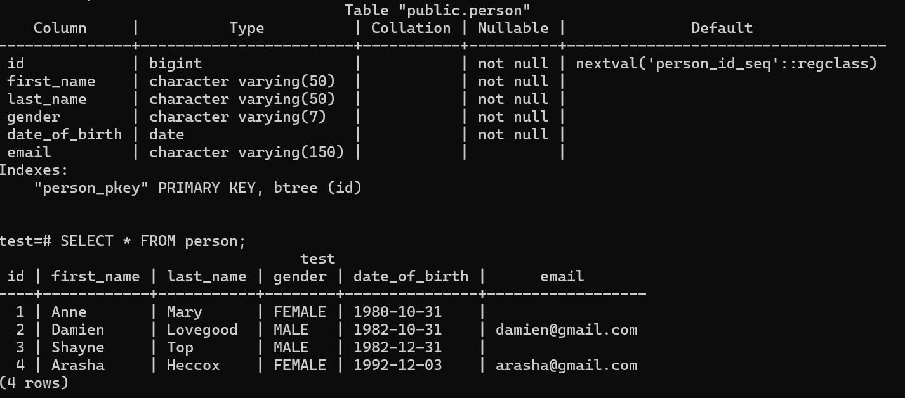

# PostgreSQL_Tutorial

## To Practice:
- Setting up PSQL

- Creating a Database

- Connecting to Databases

- Creating Tables

- Creating Tables with Constraints

- INSERT INTO

- SELECT FROM

- Write SQL queries using your database to Filter records, Sort records, Search using LIKE/ILIKE, Perform aggregate calculations, Group and analyse data

## Instructions to Run:
1. Install PostgreSQL 

2. Open psql SQL Shell:
    - Press enter on all as default
    - Enter your password

3. Create a database using SQL:
    - Run: CREATE DATABASE test;

4. To connect to test database in psql:
    - Use \c command - \c test

5. Create a table with constraints as shown in person.sql file:

        CREATE TABLE person (
        id BIGSERIAL NOT NULL PRIMARY KEY,
        first_name VARCHAR(50) NOT NULL,
        last_name VARCHAR(50) NOT NULL,
        gender VARCHAR(7) NOT NULL,
        date_of_birth DATE NOT NULL,
        email VARCHAR(150) 
        );

6. Insert Values into table:

        INSERT INTO person (first_name, last_name, gender, date_of_birth) VALUES ('Anne', 'Mary', 'FEMALE', date '1980-10-31');

7. To Run person.sql file directly in psql shell:
    - Use command - \i (insert file path)

8. Retrieve records in table using SQL:
        SELECT * FROM person;

